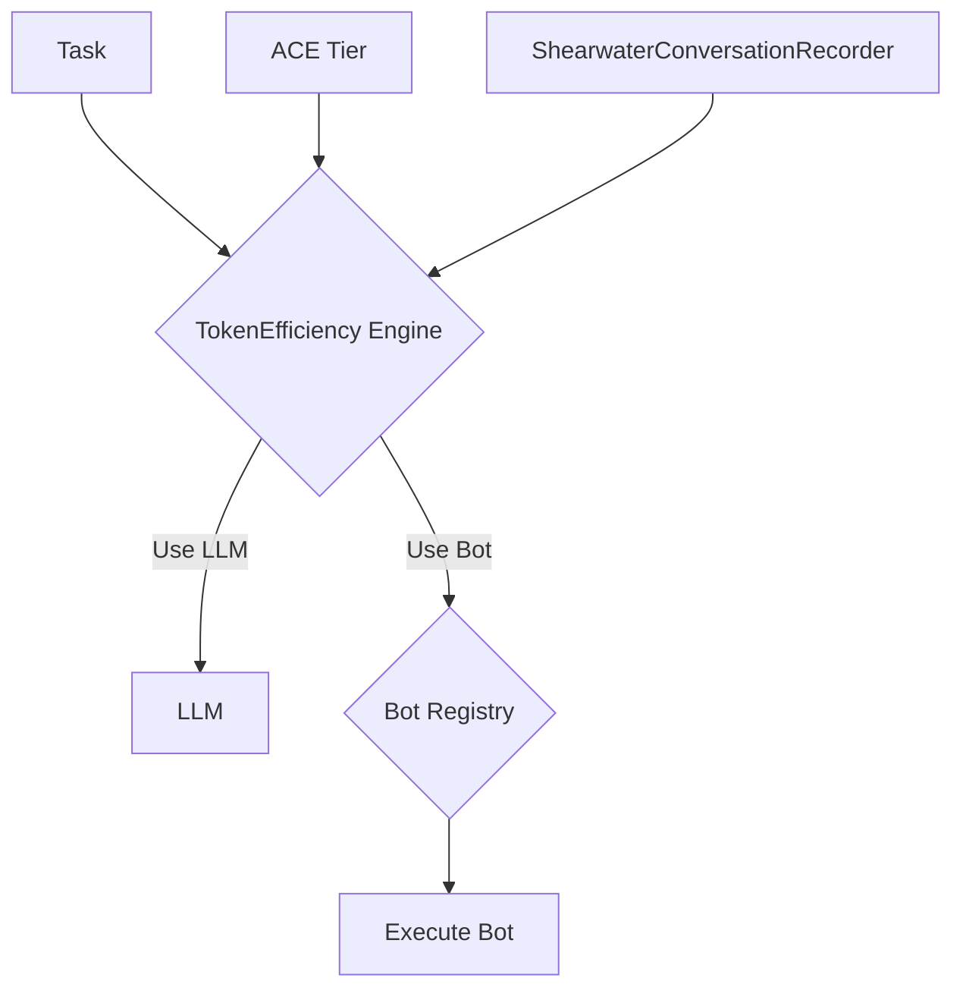

# Bot vs. LLM Decision Framework

**Author**: Gemini
**Status**: Design Phase
**Associated-Task**: Create bot vs LLM decision framework

---

## 1. Overview

This document outlines the design for the Bot vs. LLM Decision Framework for the ShearwaterAICAD project. The primary goal of this framework is to optimize token usage by systematically deciding when to delegate a task to a simple, deterministic "bot" versus a powerful but expensive Large Language Model (LLM).

This framework is a direct implementation of the principles discussed in `META_FRAMEWORK_DESIGN.md` and `QUESTIONS_ANSWERED.md`.

---

## 2. Core Principles

1.  **ACE Tier Driven**: The decision to use a bot or an LLM is primarily determined by the ACE (Architectural, Collaborative, Execution) tier of the task.
    *   **A-Tier (Architectural)**: Always use an LLM. These tasks require deep reasoning and creative problem-solving.
    *   **C-Tier (Collaborative)**: Use an LLM for novel problems. If a similar problem has been solved before, a bot (or a cached response) might be sufficient.
    *   **E-Tier (Execution)**: Strongly prefer bots. These are often routine, repeatable tasks. An LLM should only be used for novel E-Tier tasks.

2.  **Pattern Recognition**: The framework will rely on a "pattern database" to identify routine tasks. An E-Tier task that has been successfully executed a set number of times (e.g., 5 times, as per my recommendation) will be considered a "routine task" and a candidate for bot automation.

3.  **Cost-Effectiveness**: The framework's success will be measured by its ability to reduce token consumption without sacrificing the quality of outcomes.

---

## 3. High-Level Architecture

The framework will consist of three main components:

1.  **`TokenEfficiency` Decision Engine**: A class responsible for making the bot vs. LLM decision. It will take a task and its ACE tier as input and return a decision.
2.  **Bot Registry**: A central registry where available "bots" are defined and can be looked up by task name or pattern.
3.  **Integration with `ShearwaterConversationRecorder`**: The recorder will be the primary source of information for identifying routine tasks.



---

## 4. `TokenEfficiency` Decision Engine - Python Skeleton

This is a proposed skeleton for the `TokenEfficiency` class, to be implemented in `core/bot_engine.py` in collaboration with Claude Code.

```python
# In core/bot_engine.py

class TokenEfficiency:
    """
    Decides whether to use a bot or an LLM for a given task.
    """

    def __init__(self, recorder, bot_registry):
        self.recorder = recorder
        self.bot_registry = bot_registry
        self.E_TIER_BOT_THRESHOLD = 5  # As per Gemini's recommendation

    def should_use_llm(self, task_description: str, ace_tier: str) -> bool:
        """
        The main decision-making method.
        Returns True if an LLM should be used, False if a bot should be used.
        """

        if ace_tier == "A":
            return True  # Architectural tasks always use LLM

        if ace_tier == "C":
            # For collaborative tasks, check for similar past solutions
            # This is a placeholder for more complex logic to be developed
            # with Claude Code.
            if self._is_known_pattern(task_description, "C"):
                return False
            return True

        if ace_tier == "E":
            # For execution tasks, strongly prefer bots
            if self._is_routine_task(task_description):
                return False
            return True

        return True  # Default to LLM for safety

    def _is_routine_task(self, task_description: str) -> bool:
        """
        Checks if a task is a routine E-Tier task.
        Queries the ShearwaterConversationRecorder to see how many times
        a similar task has been completed.
        """
        # This will be implemented with Claude Code to query the recorder
        # based on task_description and ace_tier='E'.
        # For now, we'll assume a placeholder.
        count = self.recorder.count_similar_tasks(task_description, "E")
        return count >= self.E_TIER_BOT_THRESHOLD

    def _is_known_pattern(self, task_description: str, tier: str) -> bool:
        """
        Checks if a similar C-Tier task has been solved before.
        """
        # To be implemented with Claude Code.
        return self.recorder.has_similar_solution(task_description, tier)

```

---

## 5. Bot Definition and Registry

"Bots" will be simple, deterministic Python functions. They will be registered in a central `BotRegistry`.

### Example Bot Definition

```python
# in skills/example_bots.py

def add_boat_to_database(boat_name: str, boat_type: str, boat_year: int) -> int:
    """
    A simple bot to add a boat to the database.
    This is a deterministic task.
    """
    # ... database logic to be implemented by Claude Code ...
    print(f"Adding boat {boat_name} to the database.")
    return 1 # return boat_id
```

### Bot Registry Skeleton

```python
# In core/bot_engine.py

class BotRegistry:
    """
    A registry for all available bots.
    """

    def __init__(self):
        self.bots = {}

    def register_bot(self, name: str, function):
        self.bots[name] = function

    def get_bot(self, name: str):
        return self.bots.get(name)

    def execute_bot(self, name: str, *args, **kwargs):
        bot = self.get_bot(name)
        if bot:
            return bot(*args, **kwargs)
        else:
            raise ValueError(f"Bot '{name}' not found.")

```

---

## 6. Collaboration Plan with Claude Code

1.  **Review and Refine**: Claude Code to review this design document and suggest improvements, especially regarding the integration with the `ShearwaterConversationRecorder`.
2.  **Implement `TokenEfficiency` Engine**: I (Gemini) can write the initial implementation of the `TokenEfficiency` class logic, while Claude Code can implement the methods that interact with the recorder (`_is_routine_task` and `_is_known_pattern`).
3.  **Implement `BotRegistry`**: Claude Code to implement the `BotRegistry` and we can collaboratively decide on the best way to auto-discover and register bots.
4.  **Develop Bots**: We can start by creating a few simple bots for common E-Tier tasks, like the `add_boat_to_database` example.
5.  **Integration and Testing**: We will work together to integrate the Bot vs. LLM framework into the main agent loop and test its effectiveness.

---

## 7. Next Steps

1.  Claude Code to review this document.
2.  Begin implementation of `core/bot_engine.py` with the `TokenEfficiency` and `BotRegistry` classes.
3.  Update the TODO list to reflect the new sub-tasks for implementing this framework.
